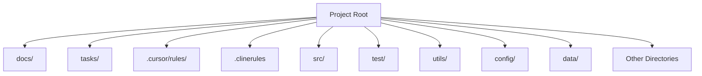

# 🔥 The Rules Template: Universal Rules for AI Coding Assistants 🔥

This template provides a robust and adaptable framework of rules designed to enhance the performance of AI coding assistants like Cursor and CLINE. Rooted in established software engineering principles and documentation best practices, it ensures consistent and effective AI-assisted development across different platforms.

## Core Principles

This template is built upon two fundamental pillars:

**a) Software Engineering Best Practices:**  Embracing time-tested methodologies to ensure code quality, maintainability, and efficiency.

**b) Software Development Documentation:**  Leveraging comprehensive documentation to provide context, guide development, and serve as persistent memory for AI coding assistants.

By combining these principles, the Rules Template aims to provide a structured and reliable approach to AI-assisted coding.

## Key Files and Concepts

This template is organized around three core files, each addressing a critical aspect of the development process:

### 1. Rules: Systematic Workflow for Tasks

The `rules` files (located in `clinerules/rules` and `cursor/rules/rules.mdc`) define a structured, five-phased workflow for approaching any development task, regardless of granularity. This workflow is based on standard software engineering best practices and promotes a systematic approach to problem-solving.

**Five-Phased Workflow:**

**(i) Requirements and Clarifications:**
   - Emphasizes the importance of clearly defining requirements and seeking thorough clarifications at the outset.
   - Aims to eliminate ambiguity, ensure precise understanding, and anticipate potential challenges early in the development cycle.

**(ii) Exhaustive Searching and Optimal Plan:**
   - Advocates for exploring a wide range of potential solutions and rigorously evaluating their merits.
   - Focuses on identifying the optimal approach, potentially through a combination of different strategies, and justifying the chosen solution with sound reasoning.

**(iii) User Validation:**
   - Highlights the necessity of validating the proposed plan with the user, ensuring alignment and agreement on assumptions and design decisions.
   - Promotes transparency and collaborative decision-making before implementation.

**(iv) Implementation:**
   - Recommends an iterative implementation approach, focusing on building and thoroughly testing one functionality at a time.
   - Emphasizes incremental development to enhance system robustness and manage complexity effectively.

**(v) Further Suggestions:**
   - Encourages proactive identification of potential optimizations, additional features, or enhancements for security and functionality post-implementation.
   - Promotes continuous improvement and forward-thinking in the development process.

This five-phased workflow is designed to be adaptable and applicable at various levels of development, from entire projects to individual functionalities, ensuring a consistent and structured approach throughout.

### 2. Memory: Persistent Project Documentation

The `memory` files (located in `clinerules/memory` and `cursor/rules/memory.mdc`) establish a robust documentation system that serves as persistent memory for the project and the AI assistant. This system is inspired by standard software development documentation practices, including PRDs, architecture plans, technical specifications, and RFCs.

**Memory Files Structure:**

The memory system is structured into Core Files (required) and Context Files (optional), forming a hierarchical knowledge base for the project.

```mermaid
flowchart TD
    PB@ [product_requirement_docs.md ] --> PC@ [technical.md ]
    PB --> SP[ @docs/architecture.md ]

    SP --> TC[tasks/tasks_plan.md ]
    PC --> TC
    PB --> TC
    
    TC --> AC[tasks/active_context.md ]

    AC --> ER[.cursor/rules/error-documentation.mdc]
    AC --> LL[.cursor/rules/lessons-learned.mdc ]
    
    subgraph LIT[ docs/literature ]
        L1[...]
        L2[...]
    end
    
    subgraph RFC[ tasks/rfc/ ]
        R1[...]
        R2[...]
    end
    
    PC --o LIT
    TC --o RFC
    
    LIT ~~~ PC
    RFC ~~~ TC
```

**Core Files (Required):**

1.  **`product_requirement_docs.md` (docs/product_requirement_docs.md):** Product Requirement Document (PRD) or Standard Operating Procedure (SOP).
    - Defines the project's purpose, problems it solves, core requirements, and goals.
    - Serves as the foundational document and source of truth for project scope.

2.  **`architecture.md` (docs/architecture.md):** System Architecture Document.
    - Outlines the system's design, component relationships, and dependencies.

3.  **`technical.md` (docs/technical.md):** Technical Specifications Document.
    - Details the development environment, technologies used, key technical decisions, design patterns, and technical constraints.

4.  **`tasks_plan.md` (tasks/tasks_plan.md):** Task Backlog and Project Progress Tracker.
    - Provides an in-depth list of tasks, tracks project progress, current status, and known issues.

5.  **`active_context.md` (tasks/active_context.md):** Active Development Context.
    - Captures the current focus of development, active decisions, recent changes, and next steps.

6.  **`error-documentation.mdc` (.cursor/rules/error-documentation.mdc):** Error Documentation.
    - Documents reusable fixes for mistakes and corrections, serving as a knowledge base of known issues and resolutions.

7.  **`lessons-learned.mdc` (.cursor/rules/lessons-learned.mdc):** Lessons Learned Journal.
    - A project-specific learning journal that captures patterns, preferences, and project intelligence for continuous improvement.

**Context Files (Optional):**

1.  **`docs/literature/`:** Literature Survey and Research Directory.
    - Contains research papers and literature surveys in LaTeX format (`docs/literature/*.tex`).

2.  **`tasks/rfc/`:** Request for Comments (RFC) Directory.
    - Stores RFCs for individual tasks in LaTeX format (`tasks/rfc/*.tex`), providing detailed specifications and discussions for specific functionalities.

**Additional Context:**

Further files and folders can be added within `docs/` or `tasks/` to organize supplementary documentation such as integration specifications, testing strategies, and deployment procedures.

### 3. Directory Structure: Modular Project Organization

The `directory-structure` files (located in `clinerules/directory-structure` and `cursor/rules/directory-structure.mdc`) define a clear and modular directory structure to organize project files logically. This structure promotes separation of concerns and enhances project maintainability.

**Directory Structure Diagram:**



This structure ensures that different aspects of the project, such as code, tests, configurations, and documentation, are kept separate and well-organized.

## Advantages of Using the Rules Template

1.  **Cross-Platform Compatibility:** Usable seamlessly with Cursor, CLINE, RooCode, Windsurf, and other AI coding assistants.
2.  **Context Sharing:** Enables context sharing and consistent workflows across different AI assistants, facilitating collaborative and platform-agnostic development.
3.  **Up-to-Date Compatibility:** Designed to be compatible with the latest versions of Cursor and CLINE, ensuring long-term usability.
4.  **Automated Documentation Generation:**  Provides the foundation for automatically generating comprehensive project documentation in PDF format, streamlining documentation efforts.
5.  **Amalgamation of Memory and Custom Prompts:** Combines the benefits of persistent project memory with customizable prompts (like `.clinerules/.cursorrules`) for a balanced approach to AI-assisted coding.
6.  **Foundation in Software Engineering Principles:** Built upon established software engineering and documentation best practices, ensuring a robust and reliable framework.
7.  **Precise Control and Flexibility:** Strikes a balance between providing precise guidance to LLMs and allowing for exploration and adaptability in problem-solving.
8.  **Adaptation of Traditional Software Engineering:** Bridges the gap between traditional software engineering methodologies and modern AI-assisted development.
9.  **Potential for Auto-Evolving Rules:**  Opens up possibilities for AI-driven rule evolution and refinement, allowing the template to adapt and improve over time.

By adhering to the principles and structure outlined in this Rules Template, development teams can leverage AI coding assistants more effectively, ensuring consistency, quality, and maintainability across their projects.
