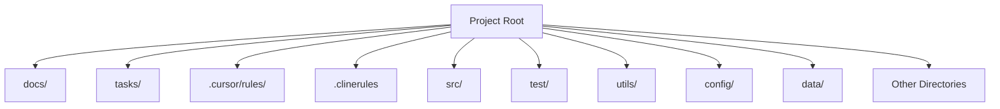
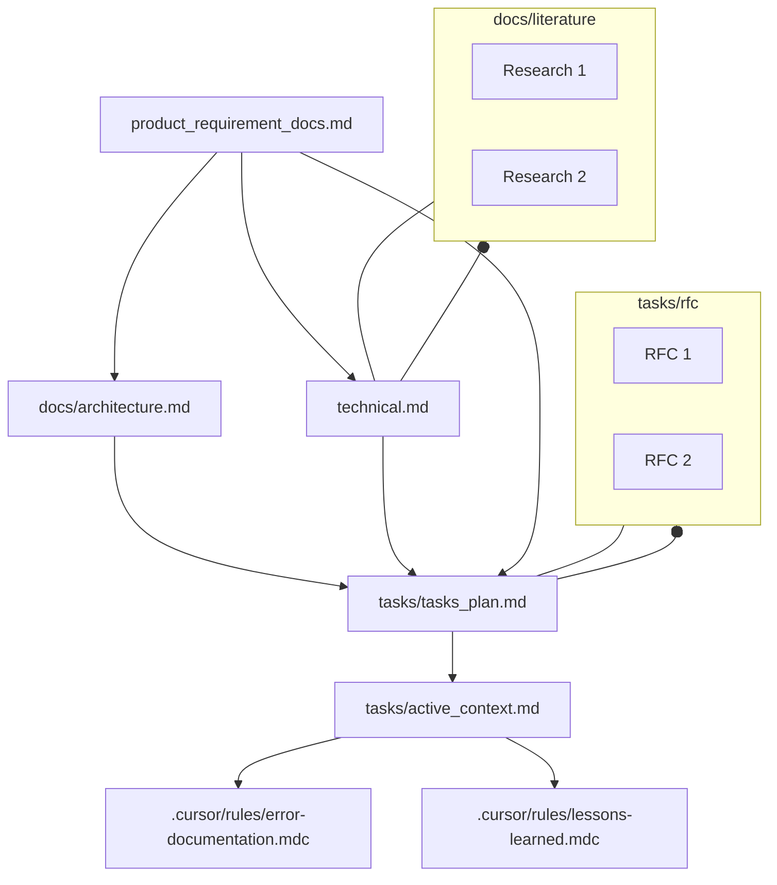

# 🔥 The Rules Template: Universal Rules for AI Coding Assistants 🔥

This template provides a robust and adaptable framework of rules designed to enhance the performance of AI coding assistants like Cursor and CLINE. Rooted in established software engineering principles and documentation best practices, it ensures consistent and effective AI-assisted development across different platforms.

## Directory Structure

Below is the top-level directory structure from <em>clinerules/directory-structure</em>. This structure is central to how the project is organized:

• <code>.cursor/rules/</code> – Custom rules for Cursor  
• <code>.clinerules/</code> – Custom rules for CLINE  
• <code>docs/</code> – Project documentation, architecture, and reference materials  
• <code>tasks/</code> – Task plans, active context, RFCs, and general to-do items  
• <code>src/</code> – Main source code  
• <code>test/</code> – Testing suite  
• <code>utils/</code> – Utility scripts or libraries  
• <code>config/</code> – Configuration files  
• <code>data/</code> – Data resources  
• (and potentially more directories as the project grows)

## Core Principles

This template is built upon two fundamental pillars:

**a) Software Engineering Best Practices:**  Embracing time-tested methodologies to ensure code quality, maintainability, and efficiency.

**b) Software Development Documentation:**  Leveraging comprehensive documentation to provide context, guide development, and serve as persistent memory for AI coding assistants.

By combining these principles, the Rules Template aims to provide a structured and reliable approach to AI-assisted coding.

# Rule Files:

This template relies on a carefully orchestrated system of directories and files for Cursor, Windsurf, CLINE and RooCode Within each environment, there are exactly three crucial files that shape how the AI operates:

1. <strong>rules</strong> (rules.mdc) –  
   Houses the comprehensive set of software engineering best practices, AI coding guidelines, and systematic workflows. These rules ensure the AI agent manages tasks, planning, and code implementations rigorously.

2. <strong>memory</strong> (memory.mdc) –  
   Maintains a persistent memory of the project context using structured documentation. It includes references to project requirements, architecture, tasks, and a chain-of-thought methodology. This lets the AI preserve context across sessions and modes while enforcing a software-engineering lifecycle approach.

3. <strong>directory-structure</strong> (directory-structure.mdc) –  
   Dictates the top-level folder layout and how different files interrelate. This is where we define the hierarchy of docs, tasks, and source code directories, ensuring consistent organization across the entire project.

In <strong>Cursor </strong>, these three files reside in <code>.cursor/rules</code>:

<code>.cursor/rules/rules.mdc</code> 
 <code>.cursor/rules/memory.mdc</code> 
 <code>.cursor/rules/directory-structure.mdc</code>
  
In <strong>CLINE</strong>, these three files reside in <code>.clinerules/</code>:

 <code>.clinerules/rules</code> 
 <code>.clinerules/memory</code>  
 <code>.clinerules/directory-structure</code> 
 
For <strong>Windsurf</strong> just add the files in <code>.windsurfrules</code>.

## Key Files and Concepts

This template is organized around three core files, each addressing a critical aspect of the development process:

### 1. Rules: Systematic Workflow for Tasks

The `rules` files (located in `clinerules/rules` and `cursor/rules/rules.mdc`) define a structured, five-phased workflow for approaching any development task, regardless of granularity. This workflow is based on standard software engineering best practices and promotes a systematic approach to problem-solving.

**Five-Phased Workflow:**

**(i) Requirements and Clarifications:**
   - Emphasizes the importance of clearly defining requirements and seeking thorough clarifications at the outset.
   - Aims to eliminate ambiguity, ensure precise understanding, and anticipate potential challenges early in the development cycle.

**(ii) Exhaustive Searching and Optimal Plan:**
   - Advocates for exploring a wide range of potential solutions and rigorously evaluating their merits.
   - Focuses on identifying the optimal approach, potentially through a combination of different strategies, and justifying the chosen solution with sound reasoning.

**(iii) User Validation:**
   - Highlights the necessity of validating the proposed plan with the user, ensuring alignment and agreement on assumptions and design decisions.
   - Promotes transparency and collaborative decision-making before implementation.

**(iv) Implementation:**
   - Recommends an iterative implementation approach, focusing on building and thoroughly testing one functionality at a time.
   - Emphasizes incremental development to enhance system robustness and manage complexity effectively.

**(v) Further Suggestions:**
   - Encourages proactive identification of potential optimizations, additional features, or enhancements for security and functionality post-implementation.
   - Promotes continuous improvement and forward-thinking in the development process.

This five-phased workflow is designed to be adaptable and applicable at various levels of development, from entire projects to individual functionalities, ensuring a consistent and structured approach throughout.

### 2. Memory: Persistent Project Documentation

The `memory` files (located in `clinerules/memory` and `cursor/rules/memory.mdc`) establish a robust documentation system that serves as persistent memory for the project and the AI assistant. This system is inspired by standard software development documentation practices, including PRDs, architecture plans, technical specifications, and RFCs.

**Memory Files Structure:**

The memory system is structured into Core Files (required) and Context Files (optional), forming a hierarchical knowledge base for the project.

**Core Files (Required):**

  1.  **`product_requirement_docs.md` (docs/product_requirement_docs.md):** Product Requirement Document (PRD) or Standard Operating Procedure (SOP).
    - Defines the project's purpose, problems it solves, core requirements, and goals.
    - Serves as the foundational document and source of truth for project scope.

    Product Requirement Documents (PRDs) are foundational blueprints in software development, defining what a product should achieve and guiding teams to align on scope, features, and objectives [1, 4]. PRDs serve multiple purposes: defining product scope and goals, aligning stakeholders across teams, and mitigating risks early in development [12, 14]. They offer significant utility by providing clarity on product vision, prioritizing features, ensuring quality, and enabling traceability throughout the development lifecycle [6, 15]. While traditionally detailed in Waterfall, PRDs are adapted for Agile methodologies as leaner, iterative documents [7, 9]. Related documents include Market Requirements Documents (MRDs) and Functional Requirements Documents (FRDs) [1, 3].

2.  **`architecture.md` (docs/architecture.md):** System Architecture Document.
    - Outlines the system's design, component relationships, and dependencies.

    Software architecture documentation is a blueprint that captures design decisions, component interactions, and non-functional requirements [1, 2]. It serves to preserve design rationale, support scalability, and facilitate decision-making [1, 6]. Key benefits include improved knowledge sharing, risk mitigation, and stakeholder communication [2, 7]. Types of architecture documentation vary, including decision-centric ADRs, structural C4 model diagrams, and behavioral sequence diagrams [7, 8]. Frameworks like arc42 provide structured templates for comprehensive architecture documentation [8].

3.  **`technical.md` (docs/technical.md):** Technical Specifications Document.
    - Details the development environment, technologies used, key technical decisions, design patterns, and technical constraints.

    Technical Specifications Documents (TSDs) serve as blueprints translating business needs into technical guidelines [1, 9]. They clarify project vision, bridge stakeholder communication, and mitigate risks [5, 12]. TSDs are highly useful for engineers as step-by-step guides, for teams as alignment tools, and for projects in ensuring accountability [1, 5]. Technical documentation broadly includes process documentation like TSDs and SRS, product documentation (user manuals, API docs), and specialized specs for IT or Agile projects [6, 13]. A robust TSD enhances project clarity and reduces failure risks associated with unclear requirements [5].

4.  **`tasks_plan.md` (tasks/tasks_plan.md):** Task Backlog and Project Progress Tracker.
    - Provides an in-depth list of tasks, tracks project progress, current status, and known issues.

5.  **`active_context.md` (tasks/active_context.md):** Active Development Context.
    - Captures the current focus of development, active decisions, recent changes, and next steps.

6.  **`error-documentation.mdc` (.cursor/rules/error-documentation.mdc):** Error Documentation.
    - Documents reusable fixes for mistakes and corrections, serving as a knowledge base of known issues and resolutions.

7.  **`lessons-learned.mdc` (.cursor/rules/lessons-learned.mdc):** Lessons Learned Journal.
    - A project-specific learning journal that captures patterns, preferences, and project intelligence for continuous improvement.

**Context Files (Optional):**

1.  **`docs/literature/`:** Literature Survey and Research Directory.
    - Contains research papers and literature surveys in LaTeX format (`docs/literature/*.tex`).

2.  **`tasks/rfc/`:** Request for Comments (RFC) Directory.
    - Stores RFCs for individual tasks in LaTeX format (`tasks/rfc/*.tex`), providing detailed specifications and discussions for specific functionalities.

    Request for Comments (RFCs) are structured proposals for technical decision-making and standardization [1, 2]. They document technical specifications, solicit feedback, and preserve institutional knowledge [4, 9]. RFCs enhance utility by reducing silos, mitigating risks, and ensuring decision traceability [5, 9]. Types range from standards-track protocol specifications to organizational RFCs for team-specific designs [5, 11]. Modern RFCs often include problem statements, proposed solutions, alternatives, rollout plans, and security impact assessments [9, 10]. While RFCs improve decision quality, they also pose challenges like time overhead and consensus bottlenecks [6, 11].

**Additional Context:**

Further files and folders can be added within `docs/` or `tasks/` to organize supplementary documentation such as integration specifications, testing strategies, and deployment procedures.

### 3. Directory Structure: Modular Project Organization

The `directory-structure` files (located in `clinerules/directory-structure` and `cursor/rules/directory-structure.mdc`) define a clear and modular directory structure to organize project files logically. This structure promotes separation of concerns and enhances project maintainability.

**Directory Structure Diagram:**

This structure ensures that different aspects of the project, such as code, tests, configurations, and documentation, are kept separate and well-organized.

## Advantages of Using the Rules Template

1.  **Cross-Platform Compatibility:** Usable seamlessly with Cursor, CLINE, RooCode, Windsurf, and other AI coding assistants.
2.  **Context Sharing:** Enables context sharing and consistent workflows across different AI assistants, facilitating collaborative and platform-agnostic development.
3.  **Up-to-Date Compatibility:** Designed to be compatible with the latest versions of Cursor and CLINE, ensuring long-term usability.
4.  **Automated Documentation Generation:**  Provides the foundation for automatically generating comprehensive project documentation in PDF format, streamlining documentation efforts.
5.  **Amalgamation of Memory and Custom Prompts:** Combines the benefits of persistent project memory with customizable prompts (like `.clinerules/.cursorrules`) for a balanced approach to AI-assisted coding.
6.  **Foundation in Software Engineering Principles:** Built upon established software engineering and documentation best practices, ensuring a robust and reliable framework.
7.  **Precise Control and Flexibility:** Strikes a balance between providing precise guidance to LLMs and allowing for exploration and adaptability in problem-solving.
8.  **Adaptation of Traditional Software Engineering:** Bridges the gap between traditional software engineering methodologies and modern AI-assisted development.
9.  **Potential for Auto-Evolving Rules:**  Opens up possibilities for AI-driven rule evolution and refinement, allowing the template to adapt and improve over time.

By adhering to the principles and structure outlined in this Rules Template, development teams can leverage AI coding assistants more effectively, ensuring consistency, quality, and maintainability across their projects.

## References

[1]  "Product Requirement Document (PRD) in software development: purpose, utility, and types of documentation" 
[2]  "Request for Comments (RFC) in software development: purpose, utility, and types of documentation" 
[3]  "Software Architecture Document: purpose, utility, and types of architecture documentation" 
[4]  "Technical Specifications Document in software development: purpose, utility, and types of technical documentation" 
[5]  "Software Architecture Document: purpose, utility, and types of architecture documentation" 
[6]  "Request for Comments (RFC) serve as structured proposals for technical decision-making" 
[7]  "Software architecture documentation is a critical blueprint for software systems" 
[8]  "arc42 template and links documentation to non-functional requirements and team collaboration" 
[9]  "PRDs in Agile, where they might be more flexible, using user stories instead of rigid specs" 
[10]  "Tools like Aha! and Figma enable collaborative, template-driven PRDs" 
[11]  "RFCs improve decision quality, they introduce time overhead" 
[12]  "PRD benefits like clarifying vision, defining target market" 
[13]  "SMART goals in PRD, which is a good detail for key components" 
[14]  "PRD details features and functionality for a product release" 
[15]  "PRD vs. MRD and BRD (Business Requirements Document)" 
