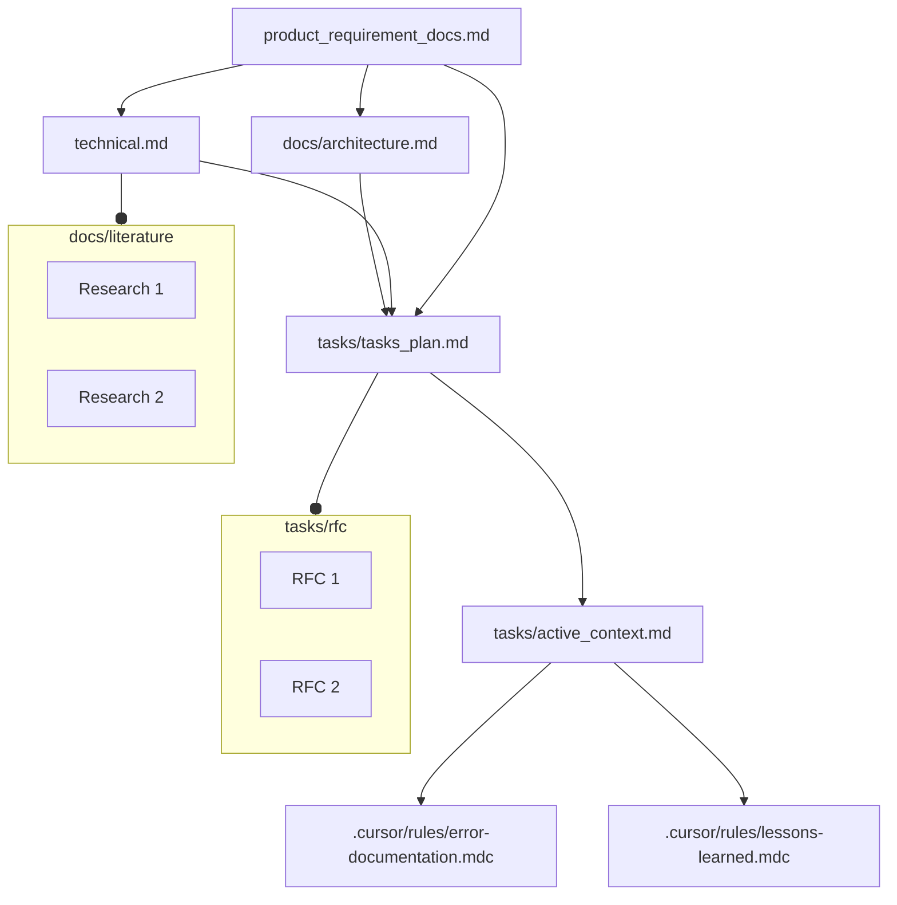

# V2: Updates [Major Token Saving updates]
## 1. The Instruction Template follows Agile Developement Methodology (Software Development Life Cycle) and Software Engineering Best Practices.
## 2. **3 New Modes** (Lean on Token Usage) are added to Cursor and RooCode.
## 3. Built on a Stable Base version used by 300+ users, based on **Agile** Workflow.
## Changelog:
1. The seperation and independence of the rules from (a) Cursor, (b) CLINE, (c) RooCode, and (d) etc, is very precise.
    a. One file only defined, and then symbolic links created to reuse it.
    b. `.cursor/rules/` directory for Cursor, has the original files. `.roo/` and `.clinerules/` are symbolic links to these original files.

2. Custom modes in (a) RooCode and (b) Cursor to save tokens. Extensively curated system prompts for these overriding the defaults.
3. Updated to conform to latest custom prompt syntax in Roo Code and CLINE.
---
---
# Motive:
To have a comprehensive and optimal Custom User Prompt (Rules) for AI coding. These kind of rules are very much required as the **Quality** of Outputs is a function $[response \, Quality = f(prompt, LLM \, model)]$. Thus, for best performance we need very detailed instructions while also giving the LLM the freedom to explore and learn. I came up with this after first reading many many existing rules, experimenting with mine and finalized these as tested against real use-cases. 
**Applications:** Tested for building Agentic products, plus writing research papers in AI.
## Target Audience: Begineer Fiendly & Potential Unlock for Experienced Folks.
Both people exploring AI without prior knowledge but tasting the AI/LLM/Agents landscape. And experieced folks adapting to and integrating AI in their workflow. As better prompts may lead to better outputs. 

## Features:
1. **Cross-Platform Compatibility:** Use in *Any* IDE *Any* number of different computers for the same project! Respects Cursor, CLINE, RooCode Rule guidelines and mechanisms natively. Like For CLINE rules use use **PLAN Mode** as in their system prompts, whereas for RooCode we use **Architect Mode**. Similarly **Act Mode** for CLINE and **Code Mode** for RooCode. **Debug Mode** for RooCode has been used additionally. 
2. **Latest Compatibility:** Designed to be compatible with the latest versions of Cursor and CLINE, RooCode. We have used `.cursor/rules/` directory for Cursor and ditched the deprecated `.cursorrules` file.For RooCode, we have used `.roo/` directory and sub directories within and not the `.clinerules` file. With CLINE we have used the the `.clinerules/` directory with sub-directories **not**  **deprecated** `.clinerules` file .
3. **Minimal Token Usage:** We have tried to make it **AS MUCH AS POSSIBLE lean on TOKEN USAGE**. We have (a) incorporated newer Modes in RooCode and Cursor, that uses minimum tokens with efficiently carrying out tasks. (b) load only relevnt context.
- We have organized the rule files to be only added when demanded (on-demand-loading). For Cursor we have seperated the rules into seperate `.mdc` files in `.cursor/rules/` directory, and configured the files so as to be added only when required. For RooCode, we have seperated the ruls into the mode specific rule files `.roo/rules-{mode}/` and not everything in `.clinerules` file. This, will only load the required rules for corresponding modes. For CLINE we did some workaround! But not much support there to save tokens for custom prompts.
4. **Common Memory Bank:** We have a common memory bank for all the AI assistants. This maintains same context across all the AI assistants. 
5. **Fundamental Software Engineering Principles:** This is to ensure that the AI is following the best practices in software development. Its **Agile** Development workflow.
Enough talking, let's get started.
5. **AUTOMATICALLY updates documentation after any planning/implementation/debugging:** The custom prompts are designed such that it will ALWAYS upadate the documentation after any change. So you focus on building, and it will take care of other things.

## Quickstart: Using this Template for AI Coding

### BASIC SETUP:
This template provides a starting point for AI pair-coding projects. To get started quickly:

1.  **Cursor:** put the `.cursor/rules/` directory in your project root.
2.  **RooCode:** put the `.roo/` directory in your project root.
3.  **CLINE:** put the `.clinerules/` direcctory in your project root.

*Note: All these can be stacked on top of each other, simultaneously.*

**DONE BASIC SETUP**
This will setup the Custom prompts and Memory Bank. What's left are Custom Modes. They are not necessary, but do that if you want to save tokens ($$).
**Note: DO NOT COPY `.git` file from this repo. Cautiously AVOID that.**
---

### ADVANCED SETUP:
We will create Custom Modes in Cursor and Roo-Code. CLINE still not supports it. So only CLINE users can skip it. 

*But I advise to check Roo Code (if you are using CLINE, its almost same).* 
## Roo Code
### Chat Mode

Step 1: Go to Prompts.


Click on the 2nd icon looking like a book, hover the cursor and it will say "Prompts".

Step 2: 

In the "**Modes**" section click on "**+**" 

Step 3: 

- Name: Chat
- Slug: chat
- Save Location: Global
- Role Definition: Think Comprehensively in full depth.
- Available Tools: **NONE**
- Custom Instructions: 

Do as per the image.

Step 4: 
Click on "**Create Mode**" button at the bottom.
It should look like this:


Rest everything is already at `.roo/system-prompt-chat`.

### Write Mode

Step 3:

- Name: Write
- Slug: write
- Save Location: Global
- Role Definition: Create and Edit files and directories. A dedicated mode for all Read/Write operations and running commands.
- Available Tools: 1. Read Files, 2. Edit Files, 3. Run Command
- Custom Instructions: 
Do as per the image.

Step 4: 
Click on "**Create Mode**" button at the bottom.
It should look like this:


Rest everything is already at `.roo/system-prompt-write`.

### MCP Mode
Step 3:

- Name: MCP
- Slug: mcp
- Save Location: Global
- Role Definition: Using MCP servers connected.
- Available Tools: 1. Use MCP
- Custom Instructions: 
Do as per the image.

Step 4: 
Click on "**Create Mode**" button at the bottom.
It should look like this:


Rest everything is already at `.roo/system-prompt-mcp`.
## Cursor

### Chat Mode

Step 1:
In the Modes section go to "Add Custom Mode"


Step 2:

Fill as per the image.

In "*Advanced options*", in the box for custom instructions, paste:

> 1. Ask for clarifications and indepth follow-ups as much as possible.
>2. Break down the problem into key concepts and smaller sub-problems iteratively.
>3. Explore all directions possible.
>4. Very rigrous and deep Reasoning.
>5. Be very detailed and analytical.


### Write Mode


Step 2:

Fill as per the image.

In "*Advanced options*", in the box for custom instructions, paste:
>Create and Edit files and directories.

### MCP Mode


Step 2:

Fill as per the image.

In "*Advanced options*", in the box for custom instructions, paste:
>Run connected MCP servers. This is a dedicated mode for MCP and use other modes for read, write, run commands.

---

**Use:** This saves token and money, with all the same capabilities. But not necessary for performance. Only do if you want to save unnecessary tokens.

### Done Custom Mode Creations!

---
---
## Directory Structure
Create this directory structure for the project:

1. **`docs/`**

    ├── **`literature/`**

    ├── **`architecture.md`**

    ├── **`technical.md`**

    └── **`product_requirement_docs.md`**

2. **`tasks/`**

    ├── **`rfc/`**

    ├── **`active_context.md`**

    ├── **`tasks_plan.md`**
3. **`src/`**
4. **`test/`**
5. **`utils/`**
6. **`config/`**
7. **`data/`**


Now just start coding using Cursor/CLINE/RooCode/etc.

**Note: For existing projects, follow above steps, additionally give the prompt to AI:**

> Follow Custom Prompt to initialize and document the project in Memory Files following the structure and instructions for documenting in Memory Files. Write everything about the project in Memory Files, build a good context for the project. 

(Copy above prompt as first prompt!)

### Symbolic Links (these are automatically set up):

It's done and you need not do anything. Just for your info.

#### .roo/
1. `.roo/rules/memory.mdc` has symbolic link to `.cursor/rules/memeory.mdc`
2. `.roo/rules/directory-structure.mdc` has symbolic link to `.cursor/rules/directory-structure.mdc`
3. `.roo/rules/rules.mdc` has symbolic link to `.cursor/rules/rules.mdc`
Mode Specific Instructions:
4. `.roo/rules-architect/plan.mdc` has symbolic link to `.cursor/rules/plan.mdc`
5. `.roo/rules-code/implement.mdc` has symbolic link to `.cursor/rules/implement.mdc`
6. `.roo/rules-debug/debug.mdc` has symbolic link to `.cursor/rules/debug.mdc`


#### .clinerules/
1. `.clinerules/rules/memory.mdc` has symbolic link to `.cursor/rules/memeory.mdc`
2. `.clinerules/rules/directory-structure.mdc` has symbolic link to `.cursor/rules/directory-structure.mdc`
3. `.clinerules/rules/rules.mdc` has symbolic link to `.cursor/rules/rules.mdc`
Mode Specific Instructions:
4. `.roo/rules-architect/plan.mdc` has symbolic link to `.clinerules/PLAN/plan.mdc`
5. `.roo/rules-code/implement.mdc` has symbolic link to `.clinerules/ACT/implement.mdc`
6. `.roo/rules-debug/debug.mdc` has symbolic link to `.clinerules/ACT/debug.mdc`
---
**Note1**: *The benefit of these symbolic links is that there is only one instance, and editing any will update all.*
**Note2**: *The directory `.cursor/rules/` is containing original files, so **DO NOT DELETE THEM**. Even if you are not using **Cursor**, have them.*


# Custom Modes
## 1. Chat
Just LLM call in this mode. NO file Reads, Write, Run Command. It is like a traditional ChatGPT. With consecutive LLM calls and a cumulative context.

## 2. Write
This has 3 capabilities: (a) Read, (b) Write and (c) Run commands. This is a very lean version that supports these requirements.

## 3. MCP
This Mode is bare ninimum System prompt for well executing the MCP server.
The system prompt has been trimmed down to the minimum.

**Note:** *This mode is to be used along with other modes, and not standalone.* There's a tool *`attemp_completion`* that is used to complete the task , which I removed from the system prompt. Still have *`switch_mode`* to switch the modes.
So, it will change to "Chat" mode after its completion by default.


# Tips in General Using Cursor, CLINE, RooCode, Windsurf:
## CLINE/RooCode:
1. Every time you change Roo Code **mode** in the middle of an task, it changes the system prompt and reset the prompt caching.

# The Rules Template: Universal Rules for AI Coding Assistants 🔥 

This template provides a robust and adaptable framework of rules designed to enhance the performance of AI coding assistants like Cursor and CLINE. Rooted in established software engineering principles and documentation best practices, it ensures consistent and effective AI-assisted development across different platforms.

## Directory Structure

Below is the top-level directory structure from <em>clinerules/directory-structure</em>. This structure is central to how the project is organized:


• <code>.cursor/rules/</code> – Custom rules for Cursor  
• <code>.clinerules/</code> – Custom rules for CLINE  
• <code>docs/</code> – Project documentation, architecture, and reference materials  
• <code>tasks/</code> – Task plans, active context, RFCs, and general to-do items  
• <code>src/</code> – Main source code  
• <code>test/</code> – Testing suite  
• <code>utils/</code> – Utility scripts or libraries  
• <code>config/</code> – Configuration files  
• <code>data/</code> – Data resources  
• (and potentially more directories as the project grows)

## Core Principles
The main aim of this template is to have rules that are fundamentally backed by software engineering concepts and have a documentation that is usually followed in large software teams.

The same documentation will form the context for the AI Coding.
Now, these same rules have been written for Cursor, CLINE and Windsurf custom rules format. Thus, having a uniform rule based across these systems. And as the context is saved as documentation in the files, so it is platform agnostic.

This template is built upon two fundamental pillars:

**a) Software Engineering Best Practices:**  Embracing time-tested methodologies to ensure code quality, maintainability, and efficiency.

**b) Software Development Documentation:**  Leveraging comprehensive documentation to provide context, guide development, and serve as persistent memory for AI coding assistants.

By combining these principles, the Rules Template aims to provide a structured and reliable approach to AI-assisted coding.
And based on the popular knowledge and research in these two fileds, we came up with this template.

# Rule Files:

This template relies on a carefully orchestrated system of directories and files for Cursor, Windsurf, CLINE and RooCode Within each environment, there are exactly three crucial files that shape how the AI operates:

1. <strong>rules</strong> –
   Thois can house generic rules. Bring your own flavour to this minimal document. Below are three files: (a) plan, (b) implement, (c) debug, that defines workflows for these three tasks based on refining 100s of rule repositories and software engineering best practices:

2. <strong>plan</strong> – Defines the Workflow to be followed for any Planning based on *chain of thinking*. includes **exhaustive searching and optimal plan, rigourous reasoning and user validation**.
3. <strong>implement</strong> - Defines the Workflow to be followed for any Implementation. inspired by concepts like **seperation of concerns, modular design, and incremental development**. Has testing mandatory after every significant implementation.
4. <strong>debug</strong> - This file defines rules for debugging when stuck in a loop or a hard debugging. Supports looking at the web and for previously solved errors too.
5. <strong>memory</strong> –
   Next comes the recommended documentation. Software documentation starts with PRDs Recording the requirements, architecture plan, technical plan, and the RFCs for individual functionality or group of functionalities.
So our documentation that also served as a context is very relevant for an AI cod as it has mostly the knowledge and the skills to work on and with these proper software documentations.
6. <strong>directory-structure</strong> (directory-structure) –
   This is a very simple file stating the directory structure so that all parts of a project development is covered like : (a) code, (b) test, (c) configurations, (d) data, (e) project rules, etc separately and in modular approach.

In <strong>Cursor </strong>, these three files reside in <code>.cursor/rules</code>:

```bash
.cursor/rules/rules.mdc
.cursor/rules/plan.mdc
.cursor/rules/implement.mdc
.cursor/rules/debug.mdc
.cursor/rules/memory.mdc
.cursor/rules/directory-structure.mdc
```
In <strong>CLINE</strong>, these three files reside in <code>.clinerules/</code>:

```bash
.clinerules/rules
.clinerules/plan
.clinerules/implement
.clinerules/debug
.clinerules/memory
.clinerules/directory-structure
```
For <strong>Windsurf</strong> just add the files in <code>.windsurfrules</code>.


## Key Files and Concepts

This template is organized around three core files, each addressing a critical aspect of the development process:

### 1. Plan/Implement/Debug: Systematic Workflow for Tasks

The `rules` files (located in `clinerules/rules` and `cursor/rules/rules.mdc`) define a structured, five-phased workflow for approaching any development task, regardless of granularity. This workflow is based on standard software engineering best practices and promotes a systematic approach to problem-solving.

**Five-Phased Workflow:**

**(i) Requirements and Clarifications:**

   it starts with making the requirements very clear and asking as much clarification as possible in the beginning. This is always the first task software development. Where all the requirements are made as precise and verbose as possible so as to save Time and effort later in redoing. Plus anticipate Major bottlenecks ahead of any work.

**(ii) Exhaustive Searching and Optimal Plan:**
  exhaustive searching and optimal plan: search all possible directions in which the problem can be solved. And find out the optimal solution, which can be also a amalgamation of many different approaches. And reason rigourously, why the chosen approach is optimal.

**(iii) User Validation:**

  validate the developed optimal plan with the user clearly stating the assumptions and design decisions made, and the reasons for them.

**(iv) Implementation:**

   implement proposed plan in an iterative way, taking one functionality at a time, testing it exhaustively with all the cases. And then building the next functionality. In this way to make the system, robust and incremental.

**(v) Further Suggestions:**

   after implementation, suggesting possible optimisation to be done or possible, additional features for security or functionality to be added.

So this five phased approach, is for a software life-cycle. But this can be applied for any grnuarlity, like entire project or a single functionality. For example, very clearly recording the requirement for the functionality and asking clarifying questions is as good for a single small functionality as for a program.
So this five phased, solution strategy workflow is to be followed at every part of development.

### 2. Memory: Persistent Project Documentation

The `memory` files (located in `clinerules/memory` and `cursor/rules/memory.mdc`) establish a robust documentation system that serves as persistent memory for the project and the AI assistant. This system is inspired by standard software development documentation practices, including PRDs, architecture plans, technical specifications, and RFCs. So, keeping these software life-cycle documentation is as focus. We develop our memory bank to have these document in sync to provide the complete context for the project. We have few additional files for current context and task plan in tasks/.


**Memory Files Structure:**

The memory system is structured into Core Files (required) and Context Files (optional), forming a hierarchical knowledge base for the project.


**Core Files (Required):**

  1.  **`product_requirement_docs.md` (docs/product_requirement_docs.md):** Product Requirement Document (PRD) or Standard Operating Procedure (SOP).
    - Defines the project's purpose, problems it solves, core requirements, and goals.
    - Serves as the foundational document and source of truth for project scope.

    Product Requirement Documents (PRDs) are foundational blueprints in software development, defining what a product should achieve and guiding teams to align on scope, features, and objectives .


2.  **`architecture.md` (docs/architecture.md):** System Architecture Document.
    - Outlines the system's design, component relationships, and dependencies.

    Software architecture documentation is a blueprint that captures design decisions, component interactions, and non-functional requirements.


3.  **`technical.md` (docs/technical.md):** Technical Specifications Document.
    - Details the development environment, technologies used, key technical decisions, design patterns, and technical constraints.


4.  **`tasks_plan.md` (tasks/tasks_plan.md):** Task Backlog and Project Progress Tracker.
    - Provides an in-depth list of tasks, tracks project progress, current status, and known issues.

5.  **`active_context.md` (tasks/active_context.md):** Active Development Context.
    - Captures the current focus of development, active decisions, recent changes, and next steps.

6.  **`error-documentation.mdc` (.cursor/rules/error-documentation.mdc):** Error Documentation.
    - Documents reusable fixes for mistakes and corrections, serving as a knowledge base of known issues and resolutions.

7.  **`lessons-learned.mdc` (.cursor/rules/lessons-learned.mdc):** Lessons Learned Journal.
    - A project-specific learning journal that captures patterns, preferences, and project intelligence for continuous improvement.

**Context Files (Optional):**

**NOTE**: I use LATEX, but you can use .md or any other format.
1.  **`docs/literature/`:** Literature Survey and Research Directory.
    - Contains research papers and literature surveys in LaTeX format (`docs/literature/*.tex`).

2.  **`tasks/rfc/`:** Request for Comments (RFC) Directory.
    - Stores RFCs for individual tasks in LaTeX format (`tasks/rfc/*.tex`), providing detailed specifications and discussions for specific functionalities.


**Additional Context:**

Further files and folders can be added within `docs/` or `tasks/` to organize supplementary documentation such as integration specifications, testing strategies, and deployment procedures.

### 3. Directory Structure: Modular Project Organization

The `directory-structure` files (located in `clinerules/directory-structure` and `cursor/rules/directory-structure.mdc`) define a clear and modular directory structure to organize project files logically. This structure promotes separation of concerns and enhances project maintainability. This is a very simple file stating the directory structure so that all parts of a project development is covered like : (a) code, (b) test, (c) configurations, (d) data, e.g. project rules, etc separately and in modular approach.

**Directory Structure Diagram:**


This structure ensures that different aspects of the project, such as code, tests, configurations, and documentation, are kept separate and well-organized.

## Advantages of Using the Rules Template

1.  **Cross-Platform Compatibility:** Usable seamlessly with Cursor, CLINE, RooCode, Windsurf, and other AI coding assistants.
2.  **Context Sharing:** Enables context sharing and consistent workflows across different AI assistants, facilitating collaborative and platform-agnostic development.
3.  **Up-to-Date Compatibility:** Designed to be compatible with the latest versions of Cursor and CLINE, ensuring long-term usability.
4.  **Automated Documentation Generation:**  Provides the foundation for automatically generating comprehensive project documentation in PDF format, streamlining documentation efforts.
5.  **Amalgamation of Memory and Custom Prompts:** Combines the benefits of persistent project memory with customizable prompts (like `.clinerules/.cursorrules`) for a balanced approach to AI-assisted coding.
6.  **Foundation in Software Engineering Principles:** Built upon established software engineering and documentation best practices, ensuring a robust and reliable framework.
7.  **Precise Control and Flexibility:** Strikes a balance between providing precise guidance to LLMs and allowing for exploration and adaptability in problem-solving.
8.  **Adaptation of Traditional Software Engineering:** Bridges the gap between traditional software engineering methodologies and modern AI-assisted development.
9.  **Potential for Auto-Evolving Rules:**  Opens up possibilities for AI-driven rule evolution and refinement, allowing the template to adapt and improve over time.

By adhering to the principles and structure outlined in this Rules Template, development teams can leverage AI coding assistants more effectively, ensuring consistency, quality, and maintainability across their projects.

## To-Do:
- [ ] 1: ignore files unified system to save tokens.
- [ ] 2: example content of each file
- [ ] 3: FAQs
- [ ] 4: TDD (Test Driven Development Prompt Injection)
- [ ] 5: Boomerang Task Mode and Context Handoff

## Additional Notes:

1. **Product Requirements Documents (PRDs):** PRDs serve multiple purposes: defining product scope and goals, aligning stakeholders across teams, and mitigating risks early in development. They offer significant utility by providing clarity on product vision, prioritizing features, ensuring quality, and enabling traceability throughout the development lifecycle . While traditionally detailed in Waterfall, PRDs are adapted for Agile methodologies as leaner, iterative documents. Related documents include Market Requirements Documents (MRDs) and Functional Requirements Documents (FRDs).
2. **Architecture Documentation:** It serves to preserve design rationale, support scalability, and facilitate decision-making. Key benefits include improved knowledge sharing, risk mitigation, and stakeholder communication. Types of architecture documentation vary, including decision-centric ADRs, structural C4 model diagrams, and behavioral sequence diagrams. Frameworks like arc42 provide structured templates for comprehensive architecture documentation.
3. **Technical Specifications:** Technical Specifications Documents (TSDs) serve as blueprints translating business needs into technical guidelines. They clarify project vision, bridge stakeholder communication, and mitigate risks. TSDs are highly useful for engineers as step-by-step guides, for teams as alignment tools, and for projects in ensuring accountability. Technical documentation broadly includes process documentation like TSDs and SRS, product documentation (user manuals, API docs), and specialized specs for IT or Agile projects. A robust TSD enhances project clarity and reduces failure risks associated with unclear requirements.
4. **RFCs (Request for Comments):** Request for Comments (RFCs) are structured proposals for technical decision-making and standardization. They document technical specifications, solicit feedback, and preserve institutional knowledge. RFCs enhance utility by reducing silos, mitigating risks, and ensuring decision traceability. Types range from standards-track protocol specifications to organizational RFCs for team-specific designs. Modern RFCs often include problem statements, proposed solutions, alternatives, rollout plans, and security impact assessments. While RFCs improve decision quality, they also pose challenges like time overhead and consensus bottlenecks.
