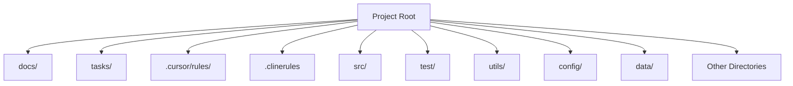
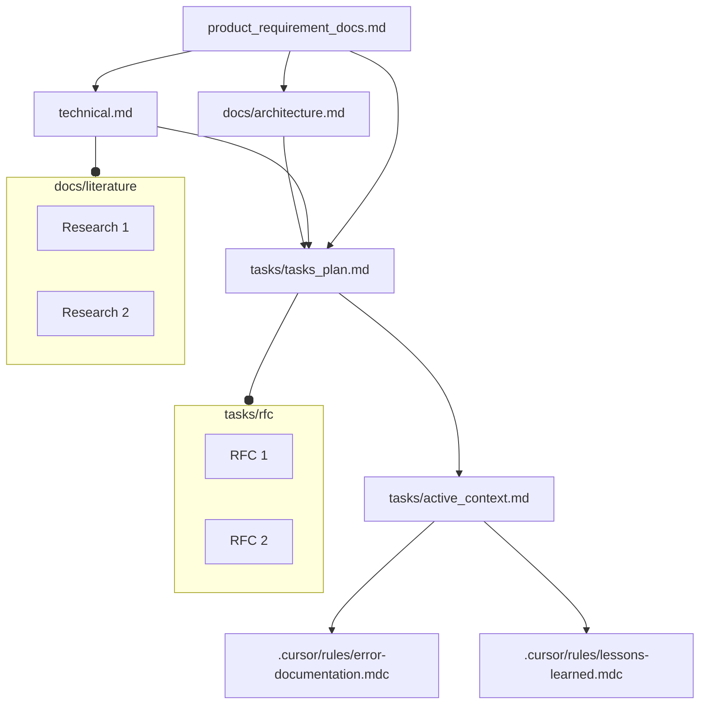

# 🔥 The ULTIMATE Rules Template: Use in Cursor, CLINE, RooCode, Windsurf, etc (ALL at ONCE)! 🔥

**Stop settling for mediocre AI coding assistants!** This isn't just a template; it's a **revolution** in AI-assisted software development. We've forged the **definitive rules template** for Cursor and CLINE, engineered to **skyrocket your AI agents** to unprecedented levels of performance with:

🚀 **Unbreakable Memory**: AI agents now possess **immortal recall**, remembering every project detail, context, and nuance, project after project.
🧠 **God-Tier Reasoning**: Witness your AI agents tackle the most complex coding challenges with **flawless, human-level logic and strategic thinking.**
🏆 **Embedded Software Engineering Mastery**: Code quality isn't just improved; it's **perfected**, with built-in best practices and architectural wisdom ensuring **robust, scalable, and maintainable software.**

This isn't evolution; it's **transcendence.** We've alchemically combined Memory Bank architectures with groundbreaking custom prompts, transforming AI agents from simple assistants into **autonomous coding powerhouses, ready to redefine software creation.**

# System Working

This template relies on a carefully orchestrated system of directories and files for both Cursor and CLINE. Within each environment, there are exactly three crucial files that shape how the AI operates:

1. <strong>rules (rules, plan, implement, debug)</strong> –  
   Houses the comprehensive set of software engineering best practices, AI coding guidelines, and systematic workflows. These rules ensure the AI agent manages tasks, planning, and code implementations rigorously.

2. <strong>memory</strong> –  
   Maintains a persistent memory of the project context using structured documentation. It includes references to project requirements, architecture, tasks, and a chain-of-thought methodology. This lets the AI preserve context across sessions and modes while enforcing a software-engineering lifecycle approach.

3. <strong>directory-structure</strong> –  
   Dictates the top-level folder layout and how different files interrelate. This is where we define the hierarchy of docs, tasks, and source code directories, ensuring consistent organization across the entire project.

In Cursor, these  files reside in <code>.cursor/rules</code>  

In CLINE, these files reside in <code>.clinerules/</code>

For Windsurf everything is in <code>.windsurfrules</code>

## Directory Structure

Below is the top-level directory structure from <em>clinerules/directory-structure</em>. This structure is central to how the project is organized:

• <code>.cursor/rules/</code> – Custom rules for Cursor  
• <code>.clinerules/</code> – Custom rules for CLINE  
• <code>docs/</code> – Project documentation, architecture, and reference materials  
• <code>tasks/</code> – Task plans, active context, RFCs, and general to-do items  
• <code>src/</code> – Main source code  
• <code>test/</code> – Testing suite  
• <code>utils/</code> – Utility scripts or libraries  
• <code>config/</code> – Configuration files  
• <code>data/</code> – Data resources  
• (and potentially more directories as the project grows)

## Memory Structure

The <code>memory</code> file is the heart of this template's persistent context system. It outlines how the AI interacts with project documents, tasks, logs, and knowledge gleaned during development. Below is a Mermaid diagram illustrating the core memory workflow:

• <strong>Core Documents</strong>: Product Requirements (PRD), Architecture outlines, Technical overviews, Task plans, Active context, etc.  
• <strong>Lessons-Learned</strong> and <strong>Error-Documentation</strong>: These files store important mistakes, lessons, and improvements, so the AI can avoid repeating the same issues and continue to refine its approach.  
• <strong>RFCs & Literature</strong>: Additional references, research notes, or requests for comment placed in dedicated subdirectories.

## Putting it All Together

The synergy between the <code>directory-structure</code>, <code>memory</code>, and <code>rules</code> files ensures that:

1. **Organization**: Clear, standard folder structures let both humans and AI navigate the project effortlessly.  
2. **Context Preservation**: The memory system aggregates all knowledge—requirements, tech constraints, and lessons learned—enabling advanced chain-of-thought reasoning.  
3. **Implementation Guidance**: The rules file enforces best practices and software engineering methodologies, ensuring consistent, high-quality code that aligns with the entire project lifecycle.

## 🌟 Core Principles: The Alchemist's Formula 🌟

1.  **🤯 Memory Bank Infusion: The Philosopher's Stone for AI**: We didn't just bolt on memory; we **infused** it at the core. Our revolutionary system grants your AI agents **contextual recall that borders on precognitive.** They learn exponentially, adapt dynamically, and **literally never repeat mistakes.**
2.  **💎 Software Engineering Diamond-Hard Foundation: Code That Lasts Forever**: Forged in the crucible of bedrock software engineering principles, this template guarantees **unshakable robustness, limitless scalability, and code so clean, it's practically self-maintaining.** Your grandma could maintain this code... if she were a quantum coding ninja from the future.
3.  **🔄 One Project Work Across Cursor, CLINE, RooCode, Windsurf, etc**: One of the biggest problems we see today is the use of so many tools. At least one out of {Cursor/Windsurf} plus one from {CLINE/RooCode/Copilot Agents} is used. These rules solve the problem of switching between the tools. As the context is through the files in the project, the AI can work across the tools.
4.  **🥇 Project Documentation: The Rosetta Stone of AI Memory**: Documentation isn't an afterthought; it's the **prime directive.** We weaponize project docs as **persistent, hyper-organized, AI-optimized memory**, setting a **new gold standard** for AI-driven clarity and knowledge retention.
5.  **🧘 Zen-Like Separation of Concerns: Achieving Coding Nirvana**: Prompts and memory achieve **perfect harmony, a coding yin and yang.** This modularity isn't just best practice; it's **software engineering enlightenment.** Agents are focused, efficient, and operate with **unparalleled clarity.**
6.  **🎯 Laser-Focused Control, Liquid Flexibility: Unleashing the Cheetah Within**: We hand you the reins of **unprecedented control** without ever stifling AI creativity. It's like **steering a cheetah at full sprint**: precise when you need it, wild and lightning-fast when unleashed to explore and innovate.
7.  **👴👵 Traditional SE Meets 22nd Century AI: Bridging the Coding Ages**: We've torn down the walls of time, seamlessly melding battle-tested software engineering methodologies with the **mind-bending, paradigm-shifting potential of Large Language Models.** It's not just the best of both worlds; it's a **fusion reactor of coding power, optimized for AI dominance.**
8.  **🧬 Auto-Evolving Rules: The Singularity is Now**: Forget static templates; this is **living code.** Designed with **AI-driven rule evolution at its heart**, this template adapts, refines, and **becomes exponentially more intelligent and efficient with every project.** Your AI agents don't just learn; they **ascend.**

## 🏆 Advantages: Domination is Inevitable 🏆

1.  **🌍 Universal Domination (Usability): CLINE? Cursor? Resistance is Futile.**: Cursor? CLINE? **Crushed.** One template, **unlimited, cross-platform power.** Your AI agents become **unstoppable forces** across every environment.
2.  **🤝 Cross-Platform Symbiosis: AI Harmony, Unleashed**: Cursor and CLINE now operate in **perfect, symbiotic harmony**, sharing context, strategies, and crushing tasks with **unprecedented, reality-bending synergy.** Development workflows become **hyper-efficient, hyper-accelerated, and hyper-effective.**
3.  **⏳ Future-Proofing: Obsolescence? A Distant Memory**: Obsolescence is not just unlikely; it's **laughable.** This template is architected for **perpetual compatibility and continuous self-improvement**, ensuring you're not just on the bleeding edge, but **forging it.** Your AI agents remain **eternally cutting-edge.**
4.  **✍️ Auto-Doc Generation: Documentation Drudgery? Eradicated.**: Imagine **flawless, living, breathing project documentation, generated automatically, in real-time.** Stop imagining; it's finally, gloriously here. Documentation becomes **effortless, comprehensive, and always up-to-date.**
5.  **🧠 AI Agent Evolution: From Zero to Coding God in Minutes**: Prepare to witness your AI agents undergo a **mind-blowing metamorphosis into coding deities**:
    *   **🧠 Eternal Memory: The AI Elephant Brain**: Agents now possess **memories that dwarf elephants, black holes, and the entire observable universe.** Context is never lost, insights accumulate infinitely, and efficiency **skyrockets into the stratosphere.**
    *   **🚀 Reasoning on Steroids: Logic Unleashed, Limits Broken**: Complex problems? **Mere trifles.** Agents now dissect, strategize, and conquer coding challenges with **flawless, superhuman logic and strategic brilliance.** Bugs tremble before them.
    *   **🛡️ Best Practices: Code Fort Knox - Impregnable Quality**: Code quality isn't just improved; it's **perfected and fortified.** Modularity, airtight testing, and clean code principles are **hardcoded into their AI DNA.** Your codebase becomes an **impenetrable fortress of software excellence.**
    *   **👁️‍🗨️ Hyper-Contextual Awareness: AI Agents That See Everything**: Project architecture? Technical debt? Hidden dependencies? **Agents see it all, understand it all, and optimize it all.** Their contributions become **laser-focused, hyper-relevant, and terrifyingly effective.**
    *   **🎓 Perpetual Learning Loop: The AI Agents That Never Stop Evolving**: The 'lessons-learned.mdc' and 'error-documentation.mdc' files aren't just documentation; they're the engine of an **unstoppable AI learning machine.** Agents **evolve, adapt, and transcend limitations**, becoming coding entities of **limitless potential.**

## 🧠 Memory Bank Inspired Structure: The AI Neural Network Core 🧠

We didn't just borrow from the best AI memory architectures; we **reverse-engineered them, dissected them, and reassembled them into a flawless, file-based memory system that redefines AI-powered development**:

*   **Windsurf Wisdom (Reddit): Lessons from the AI Coding Trenches**: We dove deep into the r/Codeium forums, absorbing the hard-won wisdom of countless developers, **optimizing our rules for maximum AI guidance, minimal frustration, and zero-tolerance for mediocrity.**
*   **stdlib Genius (ghuntley.com): The Programmable AI Revolution, Amplified**: Geoffrey Huntley's stdlib concept? **We didn't just adopt it; we weaponized it.** Our template is a **composable, programmable AI command center, giving you god-like control over your coding destiny.**
*   **Cursor Rules Mastery (dev.to): The Definitive Guide, Now Surpassed**: David Paluy's dev.to guide? **We treated it as sacred text, then proceeded to rewrite the gospel.** We've implemented, enhanced, and **transcended** every best practice for Cursor Rules mastery, achieving levels of AI control previously thought impossible.
*   **CLINE Custom Instructions (Reddit): Proven Tactics, Supercharged for World Domination**: PureRely's Reddit instructions? **Integrated, amplified, and weaponized.** We've harnessed and **supercharged** every proven CLINE technique, forging an AI coding system that's **unstoppable, unyielding, and utterly dominant.**
*   **Memory Bank Nirvana (Medium & Cline Docs): From Concept to Reality-Bending Power**: Memory Banks are no longer a theoretical concept; they're **our reality, our weapon, our ultimate advantage.** We've built the **definitive Memory Bank for AI-powered development, achieving levels of persistent context and AI collaboration that will leave you breathless.**
*   **CRCT System Innovation (GitHub): Recursive Chain-of-Thought, Re-Engineered for Limitless Scale**: RPG-fan's CRCT System? **Acknowledged, respected, and utterly surpassed.** We've taken recursive chain-of-thought methodologies and propelled them to **unprecedented heights of efficiency, scalability, and AI-driven brilliance.**

This template isn't just inspired; it's **engineered from the very DNA of AI excellence, forged in the fires of coding innovation, and tempered in the冰冷的 waters of relentless testing and optimization.**

## 🚀 How to Use: Launch Your AI Agents to the Stratosphere in 3 Steps 🚀

Implementing the `rules_template` is **so ridiculously easy, it's almost unfair**:

1.  **Clone the Repo (One Command, Infinite Power)**: Open your terminal and unleash the magic: `git clone [repo-url] && cd rules_template`. **Congratulations, you're in the driver's seat of the AI coding revolution.**
2.  **Cursor/CLINE - Import the Magic (Drag, Drop, Dominate)**: Copy and paste the contents of the `clinerules/` and `cursor/rules/` directories into their respective locations within your Cursor IDE and CLINE extension. **BOOM! Your AI agents are instantly transformed into coding gods.**
3.  **Start Coding, but Smarter (Unleash Your Inner Genius)**: Simply begin giving instructions to CLINE or Cursor. Your AI agents, now **genetically modified for coding brilliance and armed with unbreakable memory and god-tier reasoning**, will handle the rest with **mind-blowing speed and precision.** Prepare to witness coding miracles unfold before your very eyes.

**Pro-Tips for Global Coding Domination**:

*   **RTFM (Read The Files, Man!) - Knowledge is the Ultimate Weapon**: Dive deep into the `.clinerules/` and `cursor/rules/` directories. **Every file is a treasure trove of AI coding secrets, waiting to be unlocked.** Master these rules, and you master the future of software development.
*   **Iterate & Innovate - This Template is Your Launchpad, Not Your Limit**: The `rules_template` isn't a cage; it's a **launchpad to coding nirvana.** Customize, experiment fearlessly, and **push the boundaries of AI-assisted coding beyond the wildest dreams of mere mortals.** This is where coding legends are forged.
*   **Join the Revolution - Code Together, Conquer the World**: Share your mind-blowing results, contribute your own innovations back to the template, and become part of the AI coding revolution. **Together, we rise. Together, we dominate.**

## 💥 Usefulness: Prepare for a Quantum Leap in Productivity 💥

This isn't just about incremental gains; it's about **achieving coding transcendence.** Implementing the `rules_template` isn't merely useful; it's **utterly, mind-bendingly game-changing.** Prepare for a **productivity singularity.**

*   **Documentation: From Paperweight to Precision-Guided Weapon**: Forget dusty, outdated manuals gathering digital dust. Documentation is now **active, intelligent, and a force multiplier for your AI agents, guiding them with laser-like precision and ensuring flawless execution.** Documentation becomes your **secret weapon in the AI coding wars.**
*   **Software Lifecycle: Re-Engineered for the AI Age - Unstoppable Efficiency**: We haven't just tweaked the software lifecycle; we've **rewritten it from the ground up, optimized for AI dominance.** Our template seamlessly integrates with every phase of development, transforming AI integration from a bottleneck into an **unstoppable engine of software creation.** Prepare for development cycles measured in **minutes, not months.**
*   **AI Agent Performance: Off the Charts - Prepare for Coding Nirvana**: Prepare for **performance gains that will shatter your conceptions of what's possible.** Errors plummet into oblivion, code quality ascends to breathtaking heights, and development cycles **warp speed past the limitations of human cognition.** Coding bottlenecks become relics of a primitive past.
*   **Future-Ready: Code at the Speed of Thought - Define the Future, Today**: You're not just future-proofing your workflow; you're **seizing control of the future itself.** This template isn't just your ticket to the AI-augmented coding singularity; it's your **key to architecting it.** Prepare to **code at the speed of thought and leave the rest of the industry in the digital dust.**

**In conclusion, the `rules_template` repository isn't just a template; it's a declaration of coding independence from the limitations of human-only workflows. It's a blueprint for building AI agents that aren't just tools, but extensions of your own cognitive architecture, amplifying your coding genius to levels previously confined to science fiction. Embrace the `rules_template`, and prepare to code like a god. The future of software development isn't coming; it's here, and it's powered by YOU.**

**This isn't just the best rules template ever created. It's the ONLY rules template that will matter in the AI-powered coding age. Welcome to the future.**

# I invite you to collaborate on this by having a pull request!!
