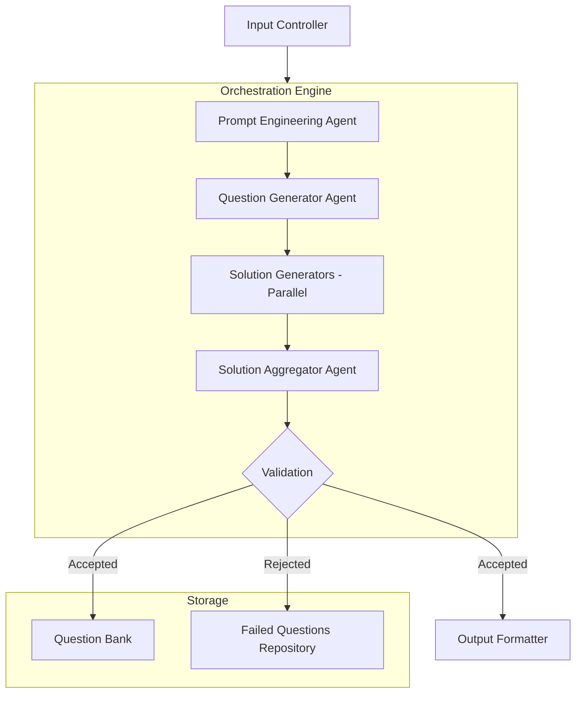

# Architecture Diagram

This diagram illustrates the architecture of the multi-agent question generation system. It shows the flow of data and interactions between different components, including the input controller, orchestration engine, LLM agent network, and storage components.

# Architecture Plan

## Overview

This document outlines the architecture for a multi-agent question generation system designed to create scientific and mathematical questions. The system is composed of several components that work together to generate, validate, and format questions.

## Component Breakdown

### 2.1 Core Components

#### 2.1.1 Input Controller
- **Purpose**: Handles user input and session management
- **Features**:
  - Text input parsing for question generation parameters
  - Session management for tracking batches of questions
  - Input validation and preprocessing
- **Technology**: Python with simple CLI interface (expandable to API)

#### 2.1.2 Orchestration Engine
- **Purpose**: Coordinates the flow between different agents
- **Features**:
  - Workflow management for the question generation pipeline
  - State tracking for each question through the pipeline
  - Parallel execution handling for solution generators
  - Retry logic for failed questions
- **Technology**: LangChain's agent framework with custom extensions

#### 2.1.3 Output Formatter
- **Purpose**: Formats generated questions for human readability
- **Features**:
  - LaTeX rendering for mathematical expressions
  - Structured output format for questions, answers, and solutions
  - Metadata tagging for organization
- **Technology**: Python with LaTeX support (MathJax/KaTeX for future web integration)

### 2.2 LLM Agent Network

#### 2.2.1 Prompt Engineering Agent
- **Purpose**: Creates optimized prompts for question generation
- **Features**:
  - Context-aware prompt templates
  - Dynamic prompt adjustment based on question type
  - Instruction refinement for specific scientific domains
- **Technology**: Smaller model (e.g., Mistral 7B or similar) with fine-tuned prompting

#### 2.2.2 Question Generator Agent
- **Purpose**: Generates high-quality questions with answers and solutions
- **Features**:
  - Domain-specific question generation
  - Detailed solution path generation
  - Difficulty calibration
- **Technology**: More powerful model (e.g., Claude, GPT-4, or similar)

#### 2.2.3 Solution Generators (Parallel)
- **Purpose**: Independently solve the generated questions
- **Features**:
  - Multiple independent LLM instances solving the same question
  - Isolation to prevent solution leakage
  - Diverse model selection to validate across different reasoning approaches
- **Technology**: 3-5 different models (e.g., Llama, Mistral, Claude, GPT variants)

#### 2.2.4 Solution Aggregator Agent
- **Purpose**: Compares solutions and validates question quality
- **Features**:
  - Solution comparison algorithms
  - Semantic matching for equivalent but differently expressed answers
  - Feedback generation for question improvement
  - Decision logic for question acceptance/rejection
- **Technology**: Medium-sized model with specialized reasoning capabilities

### 2.3 Storage Components

#### 2.3.1 Question Bank
- **Purpose**: Stores validated questions for future use
- **Features**:
  - Metadata-rich storage format
  - Categorization and tagging
  - Versioning for question refinements
- **Technology**: Local JSON/YAML files (initially), expandable to SQLite or similar

#### 2.3.2 Failed Questions Repository
- **Purpose**: Stores and analyzes rejected questions
- **Features**:
  - Failure categorization
  - Analytics for common rejection patterns
  - Feedback for improving prompt engineering
- **Technology**: Local JSON/YAML files

## Data Flow and Process

### 3.1 Question Generation Cycle

1. **User Input Phase**
   - User provides parameters for question generation
   - Input controller validates and prepares the session

2. **Prompt Creation Phase**
   - Prompt Engineering Agent crafts specialized prompt templates
   - Templates are optimized for scientific/mathematical domains

3. **Question Generation Phase**
   - Question Generator Agent receives the prompt
   - Generates question, answer, and detailed solution
   - Output is structured in a standardized format

4. **Parallel Solution Phase**
   - The question (without answer/solution) is sent to multiple Solution Generators
   - Each generator independently produces an answer and solution
   - Solutions are collected in a standardized format for comparison

5. **Validation Phase**
   - Solution Aggregator compares all solutions (including the original)
   - Applies matching algorithms to determine consensus
   - Makes accept/reject decision based on solution agreement

6. **Feedback Loop**
   - If accepted: Question is stored in the Question Bank
   - If rejected: Question is either:
     - a) Sent back to Question Generator for rephrasing
     - b) Stored in Failed Questions Repository with analysis
     - c) Discarded with feedback for prompt improvement

7. **Cycle Completion**
   - Process repeats until desired number of valid questions is generated
   - Final questions are formatted and presented to the user

### 3.2 Solution Comparison Logic

The critical component of this system is the solution comparison. I propose a multi-level validation approach:

- **Exact Answer Matching**: Direct comparison of numerical or symbolic answers
- **Semantic Answer Matching**: Meaning-based comparison for text answers
- **Solution Path Analysis**: Comparison of reasoning steps and methodology
- **Mathematical Equivalence Testing**: For equations and expressions
- **Confidence Scoring**: Weighted agreement across solution generators

## 4. Technology Stack

### 4.1 Core Technologies
- **Programming Language**: Python 3.9+
- **LLM Framework**: LangChain for agent orchestration
- **Scientific Computing**: NumPy, SymPy for mathematical processing
- **Text Processing**: NLTK/spaCy for natural language processing

### 4.2 LLM Integration
- **API Clients**: OpenAI, Anthropic, Mistral AI, etc.
- **Local Models**: Support for running smaller models locally using llama.cpp or similar
- **Caching Layer**: To minimize redundant API calls and reduce costs

### 4.3 Storage and State Management
- **File Storage**: JSON/YAML for structured data
- **State Management**: Custom state manager for tracking question lifecycle
- **Logging**: Comprehensive logging for debugging and analysis

